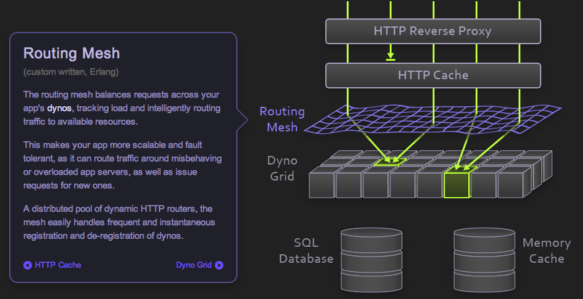

!SLIDE title-slide center bullets

# Utilizing Redis in distributed Erlang systems #

* erlang-factory.herokuapp.com

!SLIDE center smbullets incremental transition=scrollUp

# Jacob Vorreuter and Orion Henry #

* Heroku is a platform composed of heterogeneous components
* Ruby, Erlang, Go
* Components must communicate and share information

!SLIDE center smbullets incremental transition=scrollUp

* Written in C
* Single threaded
* Non-blocking, evented I/O
* Requires no external dependencies
* Supports data types such as lists, sets and hashes
* Persistence is available via async writes to disk
* Master/slave replication
* Pub/Sub capabilities

!SLIDE smbullets incremental transition=scrollUp

# How Heroku uses Redis #

* As an ephemeral registry of instance health and availability
* As a redundant cache of shared state data
* As a destination for capped collections of log data
* As a pub/sub channel powering real-time usage graphs

!SLIDE center transition=scrollUp

# Tools and examples #

!SLIDE center smbullets transition=scrollUp

# github.com/JacobVorreuter/redgrid #

* Automatic Erlang node discovery via Redis

!SLIDE center transition=scrollUp

!SLIDE center transition=scrollUp

!SLIDE transition=scrollUp small

# Attaching meta data to nodes #

	1> node().
	'foo@blah'
	2> redgrid:update_meta([{weight, 0}]).
	ok

	1> node().
	'bar@wha'
	2> redgrid:nodes().
	[{'bar@wha',  [{ip, "10.0.0.2"}]},
	 {'foo@blah', [{ip, "10.0.0.1"},
	               {weight, 0}]}]

!SLIDE center smbullets transition=scrollUp

# github.com/JacobVorreuter/redo #

* pipelined erlang redis client 

!SLIDE transition=scrollUp small

# Simple, pipelined, no sugar #

        1> redo:start_link().
        {ok,<0.33.0>}

        2> redo:cmd(["SET", "one", "abc"]).
        <<"OK">>

        3> redo:cmd(["SET", "two", "def"]).
        <<"OK">>

        4> redo:cmd([["GET", "one"],
                     ["GET", "two"]]).
        [<<"abc">>,<<"def">>]

!SLIDE transition=scrollUp small

# More commands #

        5> redo:cmd([["SADD", "sfoo", "123"],
                     ["SADD", "sfoo", "456"]]).
        [1,1]

        6> redo:cmd(["SMEMBERS", "sfoo"]).
        [<<"123">>,<<"456">>]

        7> redo:cmd(["HMSET", "hfoo",
                     "width", "100",
                     "height", "75",
                     "depth", "50"]).
        <<"OK">>

        8> redo:cmd(["HGETALL", "hfoo"]).
        [<<"width">>,<<"100">>,
         <<"height">>,<<"75">>,
         <<"depth">>,<<"50">>]
        

!SLIDE transition=scrollUp

# Fast #

        1> bench:sync(1000).
        91ms
        10989 req/sec

        2> bench:sync(10000).
        938ms
        10752 req/sec
 
!SLIDE transition=scrollUp

# Faster #

        1> bench:async(1000, 100).
        38ms
        26315 req/sec

        2> bench:async(10000, 1000).
        294ms
        34482 req/sec

        3> bench:async(34000, 1500).
        1092ms
        31250 req/sec

!SLIDE center smbullets transition=scrollUp

# github.com/JacobVorreuter/nsync

* Erlang Redis replication client

!SLIDE center smbullets incremental transition=scrollUp

# Redis replication #

* slave opens a tcp socket connected to the master redis
* slave issues a "SYNC" command
* master asynchronously dumps its dataset to disk
* dataset is transfered to the slave as an rdb dump
* master streams updates to the slave using the redis text protocol

!SLIDE transition=scrollUp

# Nsync callback structure #

        {load, Key, Value}
        {load, eof}
        {cmd, Cmd, Args}
        {error, {unhandled_command, Cmd}}
        {error, closed}

!SLIDE transition=scrollUp

# Example #

        1> nsync:start_link().

!SLIDE center transition=scrollUp

# An example of Redis at Heroku #

!SLIDE smbullets incremental transition=scrollUp

# github.com/heroku/logplex #

* Heroku log router
* Receives syslog packets
* from Heroku infrastructure components
* from user applications

!SLIDE smaller transition=scrollUp

        $ heroku logs
        heroku[web.1]: Starting process with command: `thin -p 23533 -e production -R /home/heroku_rack/heroku.ru start`
        app[web.1]: >> Thin web server (v1.2.6 codename Crazy Delicious)
        app[web.1]: >> Maximum connections set to 1024
        app[web.1]: >> Listening on 0.0.0.0:23533, CTRL+C to stop
        heroku[web.1]: State changed from starting to up
        app[web.1]: 204.14.152.118 - - [02/Jun/2011 16:27:18] "GET / HTTP/1.1" 200 9346 0.0022
        heroku[router]: GET myapp.heroku.com/ dyno=web.1 queue=0 wait=0ms service=5ms bytes=9513
        heroku[nginx]: HEAD / HTTP/1.1 | 178.63.19.47 | 0 | http | 200

!SLIDE center transition=scrollUp

# Logplex replication #

        
!SLIDE transition=scrollUp

# Erlang routing mesh #

!SLIDE center transition=scrollUp

# Redis as a redundant cache of shared state #

!SLIDE smbullets transition=scrollUp

# One limitation of Redis replication #

* Dataset is unavailable during slave resync
* Network partition or hiccup causes downtime
* (error) LOADING Redis is loading the dataset in memory

!SLIDE transition=scrollUp smaller

# redis.log #

        - Reading from client: Connection reset by peer
        * Connecting to MASTER...
        * MASTER <-> SLAVE sync started: SYNC sent
        * MASTER <-> SLAVE sync: receiving 66055964 bytes from master
        * MASTER <-> SLAVE sync: Loading DB in memory
        * MASTER <-> SLAVE sync: Finished with success

!SLIDE transition=scrollUp small

# slave-sync.sh #

        00:24:57: CONFIG SET MASTERAUTH password
        00:24:57: OK
        00:24:57: STATUS: master_link_status:down
        00:24:57: waiting for master_link_status:up
        ...
        00:25:08: STATUS: master_link_status:up
        00:25:08: CONFIG SET MASTERAUTH NULL
        00:25:08: OK

!SLIDE center transition=scrollUp

# Heroku use case #

!SLIDE center smbullets incremental transition=scrollUp

# Migrating Logplex from Redis to mnesia #

* branch logplex and add mnesia tables
* boot new cluster of empty mnesia logplex nodes
* start Nsync on new nodes replicating from master redis
* rdb dump is loaded into mnesia
* subsequent updates are loaded into mnesia
* point logplex.heroku.com dns at new cluster
* shutdown Nsync

!SLIDE center smbullets transition=scrollUp

# github.com/JacobVorreuter/tempo #

* Node.js websocket interface to Redis pub/sub channels

!SLIDE center transition=scrollUp

